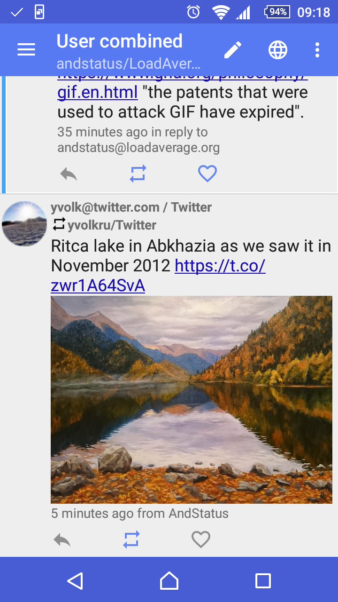
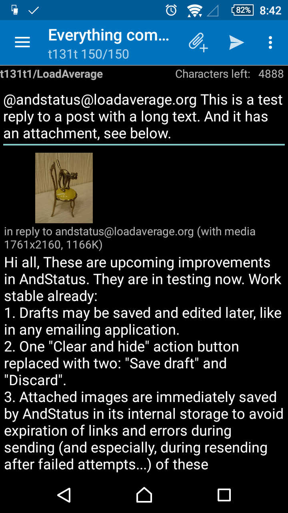
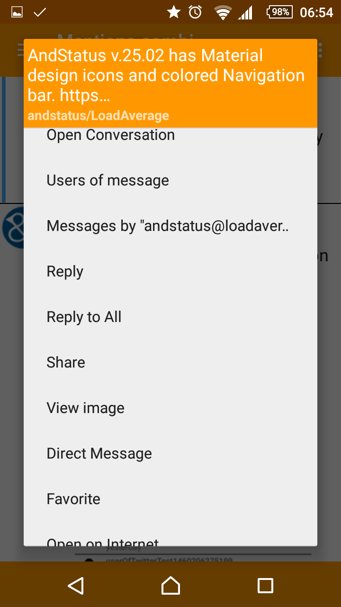
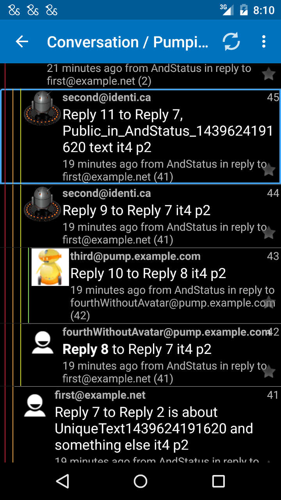

# AndStatus

AndStatus is an Open Source multiple accounts client for multiple Social networks, including
[GNU social](http://gnu.io/social), [Mastodon](https://github.com/tootsuite/documentation),
[Twitter](https://twitter.com) and [Pump.io](http://pump.io).
AndStatus can combine your feeds from all networks into one Timeline,
and it allows you to read and post even when you are offline.

For Android v.7.0+ devices.
Under Free/Libre and Open Source License.

 

See the [Change Log](http://andstatus.org/changelog.html) for descriptions of all the features of AndStatus
 and for the links to their discussion.

## Differentiating features of AndStatus:
* Many accounts in different Social networks. You may have several accounts in each, write/reply as any "You" and share between accounts and systems.
* You don't need to be online to read timelines and to post your updates: drafts and unsent posts are kept even after reboot. They will be sent when your device is Online.
* Convenient tree-like "Conversation view".
* "Global search" allowing you to search public messages in all networks with one query.
* Lists of Friends and Followers, presented as User Lists and as Timelines (with the latest message of each user)
* Tweets/messages/avatars/attached images are being synced in a background, when your device has a good connection. By default, attachments are downloaded via WiFi only.
* Cached data may be stored for years or for several days only - it's your choice.
* Backup and restore accounts and messages between your devices. Own your data!
* Free and without ads, community supported.

Read the [FAQ](doc/FAQ.md) to help you find information that is not present on this page.

For the latest news on the project please follow
[AndStatus@mastodon.social](https://mastodon.social/@AndStatus),
[@AndStatus@loadaverage.org](https://loadaverage.org/andstatus) at GNU Social,
[@AndStatus1](https://twitter.com/AndStatus1) at Twitter
or [@AndStatus@identi.ca](http://identi.ca/andstatus) at Pump.io.

AndStatus is an open project:
* Open for user's ideas, problems and questions. Please start from searching at the "[Issues](https://github.com/andstatus/andstatus/issues)" page.
Take part in discussions there. If nothing relevant was found, raise your "issue" sharing with the AndStatus community your idea,
question or a problem (providing as much details as possible in order to understand and reproduce the problem).
* Open Beta Testing channel invites volunteer testers. Please opt in [at Google Play](https://play.google.com/apps/testing/org.andstatus.app)
and start to receive both Beta and Production releases the usual way. You can opt out at any time.
* Multilingual. Crowdsourcing and collaborative localization project invites volunteer translators:
[AndStatus at Crowdin](https://crowdin.com/project/andstatus).
* Open Source, open for contributing developers. If you are a Developer, AndStatus project will help you to implement
your unique Social networking features, because you can build on working code supported by a suite of automated tests
([see the video](https://youtu.be/I5ntfahO1GY)).
[Travis CI](https://travis-ci.org/andstatus/andstatus) is used for continuous testing of the code in a publicly available
repository and pull requests.
[SonarQube](https://sonarcloud.io/dashboard?id=andstatus) checks code quality and helps improving it.
* Source code is hosted in the two popular services: [GitHub](https://github.com/andstatus/andstatus) and
[GitLab](https://gitlab.com/andstatus/andstatus). The code is commented and has links to related information on Internet.
Please read the [Developer FAQ](doc/DeveloperFAQ.md) page for more info
on building AndStatus application from the Source code.

You may [donate to AndStatus development](http://andstatus.org/donate.html) via its founder/lead developer.